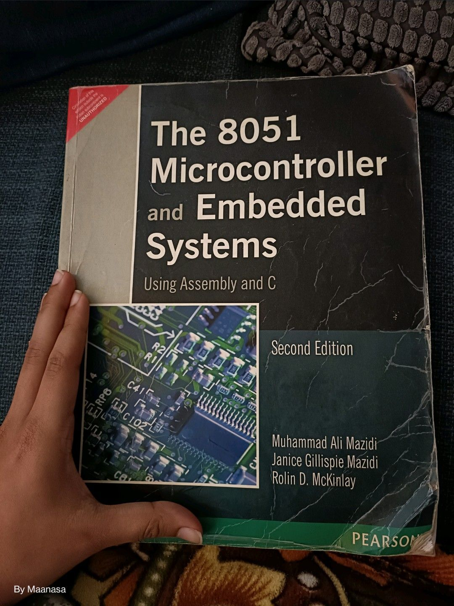

## Books: 
- Embedded Systems Architecture : Design and write software for embedded devices to build safe and connected systems - DANIELE LACAMERA

- Fundamentals of System-on-Chip Design on Arm Cortex-M Microcontrollers

